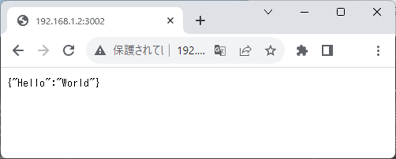
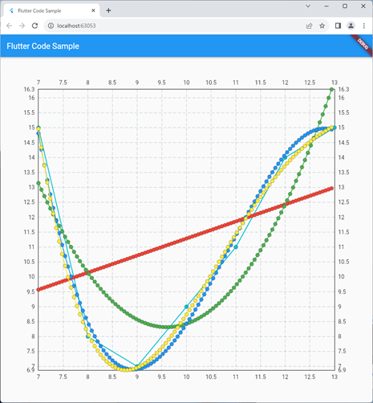
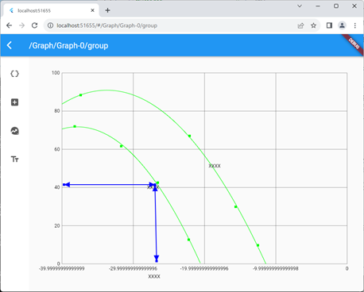
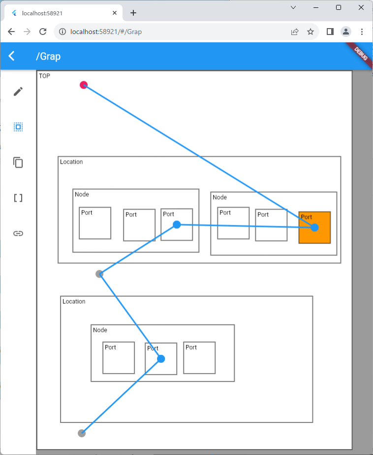
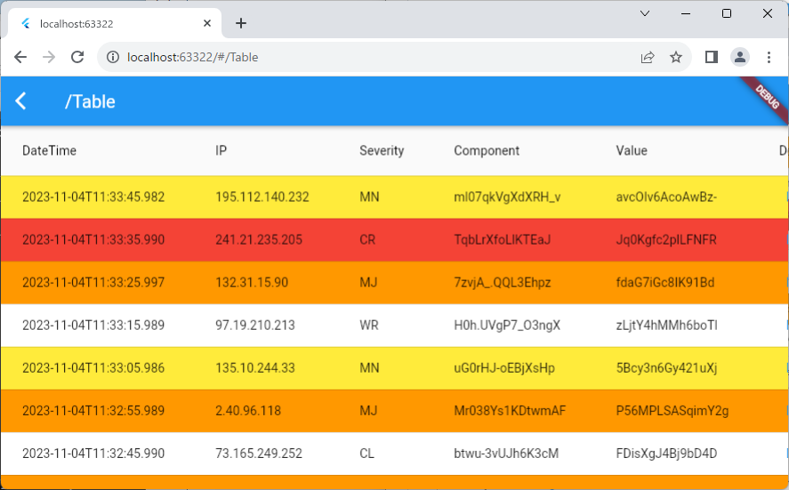
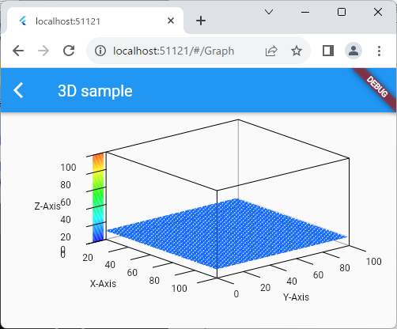
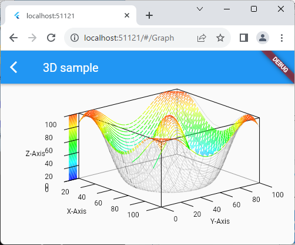

# 安藤さんお勉強用サンプルコード集

- 本コード群は安藤さんが Flutter のお勉強用に作成したものです。
- ちゃんと Python クラサバ接続してサーバと通信するところまでやります。
- 勉強用なのでよく脱線します。
- 要望等あっても安藤さんの興味がない分野は知りません。


## 目次

- [安藤さんお勉強用サンプルコード集](#安藤さんお勉強用サンプルコード集)
  - [目次](#目次)
  - [モチベーション](#モチベーション)
- [まずは github側の設定](#まずは-github側の設定)
- [Flutter](#flutter)
  - [はじめに (Flutter on the web)](#はじめに-flutter-on-the-web)
  - [インストール](#インストール)
    - [インストール(Windows)](#インストールwindows)
    - [インストール(Linux)](#インストールlinux)
  - [Hello world](#hello-world)
    - [hello world -- Linux でのサーバ起動](#hello-world----linux-でのサーバ起動)
    - [hello world -- Windows での Chrome 指定しての起動](#hello-world----windows-での-chrome-指定しての起動)
  - [Dart – hello world](#dart--hello-world)
    - [hello world -- Windows でのデスクトップ起動](#hello-world----windows-でのデスクトップ起動)
  - [Dart とインデント２文字問題](#dart-とインデント２文字問題)
  - [Dart の基本記法](#dart-の基本記法)
  - [みんな大好きλ式＆ストリーム](#みんな大好きλ式ストリーム)
  - [みんな大好きλ式＆ストリームと PythonのDictとList](#みんな大好きλ式ストリームと-pythonのdictとlist)
  - [Dict から Json への変換またはその逆](#dict-から-json-への変換またはその逆)
  - [Dart – import](#dart--import)
  - [Dart – enum](#dart--enum)
  - [Dart – class](#dart--class)
    - [getter や setter](#getter-や-setter)
    - [継承まわり](#継承まわり)
  - [Dart – Async](#dart--async)
  - [Dart – 例外](#dart--例外)
  - [Dart – 置換関係](#dart--置換関係)
  - [Dart –カスケード表記](#dart-カスケード表記)
  - [Dart -- Widget](#dart----widget)
  - [Dart – hello\_world](#dart--hello_world)
  - [Dart – ファイルを分離する](#dart--ファイルを分離する)
  - [Dart – 変数の受け渡し](#dart--変数の受け渡し)
  - [Dart - StatefulWidget でデータの受け渡し](#dart---statefulwidget-でデータの受け渡し)
  - [Dart – 画面遷移](#dart--画面遷移)
  - [Dart – 画面遷移とデータの受け渡しの組み合わせ](#dart--画面遷移とデータの受け渡しの組み合わせ)
  - [Dart - Alert Dialog](#dart---alert-dialog)
  - [Dart - リスト選択](#dart---リスト選択)
  - [テーブル表示](#テーブル表示)
  - [テキスト入力関連](#テキスト入力関連)
  - [データの保存関連](#データの保存関連)
  - [テーブルの行の追加や削除、テーブルの行の選択](#テーブルの行の追加や削除テーブルの行の選択)
  - [プロセス起動関連](#プロセス起動関連)
- [FastAPI](#fastapi)
  - [FastAPIのインストール](#fastapiのインストール)
  - [FastAPI Hello world](#fastapi-hello-world)
  - [見え方](#見え方)
  - [IP が違うとこんなエラーが出る](#ip-が違うとこんなエラーが出る)
  - [Fast API– マルチポート](#fast-api-マルチポート)
  - [Fast API– get (取得)](#fast-api-get-取得)
  - [Fast API– get/post/put/post/delete](#fast-api-getpostputpostdelete)
  - [dict 以外の返し方](#dict-以外の返し方)
  - [応答の返し方](#応答の返し方)
  - [OAuth2 と パラメータ渡し](#oauth2-と-パラメータ渡し)
  - [FastAPI と OpenAPI](#fastapi-と-openapi)
    - [openapi-generator のインストール](#openapi-generator-のインストール)
      - [Linux の場合](#linux-の場合)
      - [Windows の場合](#windows-の場合)
    - [openapi-generator でのクライアントコード生成](#openapi-generator-でのクライアントコード生成)
    - [openapi-generator で生成したクライアントコード呼び出し(python用)](#openapi-generator-で生成したクライアントコード呼び出しpython用)
    - [openapi-generator で生成したクライアントコード呼び出し(Dart/Flutter 編)](#openapi-generator-で生成したクライアントコード呼び出しdartflutter-編)
    - [CORS(クロスオリジンリソース共有)ポリシー 対策](#corsクロスオリジンリソース共有ポリシー-対策)
    - [動作確認(単純)](#動作確認単純)
    - [動作確認(OAuth2 認証ほかもろもろ)](#動作確認oauth2-認証ほかもろもろ)
  - [Fast-API で SSH (HTTPs)を実装する(生バージョン)](#fast-api-で-ssh-httpsを実装する生バージョン)
    - [pubspec.yaml にhttp... を追加](#pubspecyaml-にhttp-を追加)
    - [参考：pubspec.yaml をもっと簡単に](#参考pubspecyaml-をもっと簡単に)
    - [http... を実装](#http-を実装)
  - [FastAPI を HTTPS で動かす](#fastapi-を-https-で動かす)
  - [Docker 化について](#docker-化について)
- [グラフを書こう](#グラフを書こう)
  - [Python による最小二乗法の曲線を書く](#python-による最小二乗法の曲線を書く)
  - [Dart による最小二乗法の曲線を書く](#dart-による最小二乗法の曲線を書く)
  - [作ったものをwebで公開する](#作ったものをwebで公開する)
- [雑にグラフを書く](#雑にグラフを書く)
  - [雑にグラフを書くときに使ったワザとか](#雑にグラフを書くときに使ったワザとか)
    - [キャンバスの使い方](#キャンバスの使い方)
    - [キャンバスのクリックに反応](#キャンバスのクリックに反応)
    - [グラフ上のx,y と画面上の x,y の変換](#グラフ上のxy-と画面上の-xy-の変換)
    - [グラフと対数変換](#グラフと対数変換)
      - [グラフと対数変換](#グラフと対数変換-1)
      - [グラフと対数逆変換](#グラフと対数逆変換)
    - [テキストの書き方](#テキストの書き方)
      - [テキストのサイズの書き方](#テキストのサイズの書き方)
    - [塗りつぶし](#塗りつぶし)
    - [線を引く](#線を引く)
      - [線に矢印を入れる](#線に矢印を入れる)
    - [四角形を書く](#四角形を書く)
    - [線の太さと色](#線の太さと色)
      - [色関係](#色関係)
      - [16進数字変換](#16進数字変換)
- [android に乗せて公開したい](#android-に乗せて公開したい)
  - [外部へのリンクを作る](#外部へのリンクを作る)
  - [操作内容の動画を取る](#操作内容の動画を取る)
- [雑にネットワーク設計の図を作る](#雑にネットワーク設計の図を作る)
  - [Class の情報を Json 化する](#class-の情報を-json-化する)
- [雑に警報を作る](#雑に警報を作る)
  - [ランダムな文字列を作る](#ランダムな文字列を作る)
  - [今の時刻を取得する](#今の時刻を取得する)
  - [定期的に処理を実行する](#定期的に処理を実行する)
- [雑に 3Dグラフを作る](#雑に-3dグラフを作る)
  - [pushudName で引数を付けて渡す](#pushudname-で引数を付けて渡す)


## モチベーション

- モチベーション
 - GUIを用意してプロセスとプロセス間の連携ができないとどうにもならんでしょ？
 - どうせなら Flutter で作ってandroid 等と連携できるようにしておくと(安藤さんの)営業的に良さそうでは？

# まずは github側の設定

- [.gitignoreの設定](.gitignore)


# Flutter

## はじめに (Flutter on the web)

- もともとは Flutter は iOS/Android アプリのGUIを作図するときに使うもの
- そのためソフト開発者として潰しが利く
  - 移植が用意 ＆ 別プロジェクトからの要因取得が容易
- もちろん web でも使用することができる
  - Flutter on the web ではDartのJavaScript変換機能を使うのと同時に、
    同じWidgetであればiOS/Android・Webどちらでも同じUIになるよう
    HTML・Canvas・CSSを使い描画処理を行っています。
- デスクトップでも使える
  - その場合はプロセス起動もできる

## インストール

### インストール(Windows)
  - Web上でインストールするには以下からダウンロード
    - https://docs.flutter.dev/get-started/install/windows
  - 環境変数にパスを通す

### インストール(Linux)

```shell
t-ando@t-ando2:~/work/flutter$ t-ando@t-ando2:~/work/flutter/hello_world$ flutter upgrade
t-ando@t-ando2:~/work/flutter$ git clone https://github.com/flutter/flutter
t-ando@t-ando2:~/work/flutter$ mv flutter $HOME/.local/
```
- ~/.profile に以下を追加して再起動(または source ~/.profile)

```shell
if [ -d "$HOME/.local/flutter/bin" ] ; then
    PATH="$HOME/.local/flutter/bin:$PATH"
fi
```

- パスを通るので継続して以下実行
```shell
t-ando@t-ando2:~/work/flutter$ flutter upgrade
t-ando@t-ando2:~/work/flutter$ flutter config --enable-web
Downloading Linux x64 Dart SDK from Flutter engine 73acf62a2fe100b925114b2b7aa4bcd80fc90be8...
  % Total    % Received % Xferd  Average Speed   Time    Time     Time  Current
                                 Dload  Upload   Total   Spent    Left  Speed
100  209M  100  209M    0     0  1879k      0  0:01:53  0:01:53 --:--:-- 2443k
Building flutter tool...
..中略…
t-ando@t-ando2:~/work/flutter$
```

## Hello world

### hello world -- Linux でのサーバ起動
- ホスト名まで指定しないと(localhost 指定だと)IPv6の ::1 だけ開いてIPv6でつながらない

```shell
t-ando@t-ando2:~/work/flutter/hello_world$ flutter run -d web-server --web-hostname 192.168.1.2 --web-port 42461
Launching lib/main.dart on Web Server in debug mode...
Waiting for connection from debug service on Web Server...          5.2s
lib/main.dart is being served at http://192.168.1.2:42461
The web-server device requires the Dart Debug Chrome extension for debugging. Consider using the Chrome or Edge devices for an improved
development workflow.

?  To hot restart changes while running, press "r" or "R".
For a more detailed help message, press "h". To quit, press "q".
```

- flutter停止時に "q" で終わらないとプロセスが停止せず、再起動できない場合がある

```shell
t-ando@t-ando2:~/work/flutter/hello_world/lib$ flutter run -d web-server --web-hostname 192.168.1.2 --web-port 42461
Changing current working directory to: /home/t-ando/work/flutter/hello_world
Launching lib/main.dart on Web Server in debug mode...
… 中略 …
Failed to bind web development server:
SocketException: Failed to create server socket (OS Error: Address already in use, errno = 98), address = 192.168.1.2, port = 42461
t-ando@t-ando2:~/work/flutter/hello_world/lib$
```

- そんなときは kill でプロセスを殺しましょう
```
t-ando@t-ando2:~/work/flutter/hello_world/lib$ pgrep flutter
50558
t-ando@t-ando2:~/work/flutter/hello_world/lib$ kill -KILL 50558
```


### hello world -- Windows での Chrome 指定しての起動

- Edge なども指定できるが Visual studio のインストールが必要だと思われる
  - 動作中のコンソールに対して r ボタンを押すとホットリロードが掛かるので
  - 開発するときはこちらを使うと早く作業ができる
```shell
flutter run --device-id chrome
```


## Dart – hello world

- 何か基本に戻りすぎですが まずは以下をみましょう
  - https://dart.dev/language
- 以下をやると
  - タイトルにでます
  - コンソールにもでます
    - Chrome の画面上で右クリックして「検証」をクリックするとでてきます
```dart
void main() {
  print('Hello, World!');
}
```


### hello world -- Windows でのデスクトップ起動

- まずデスクトップ用にビルドできるように --platforms に web を追加して環境構築する
```shell
 $ flutter create --template=app --platforms web,windows --org github.com -i swift -a java --description "Network login project." --project-name network_login ./network_login
```

- *.exe ファイルを作成する場合は以下の用にリリース指定を付ける
  - windows用にビルドして実行できるが
    Visual studio が必要なので企業では購入しないと使えません
  - できたバイナリは build\windows\runner\Release にあります
```shell
 $ flutter build windows --release
```


## Dart とインデント２文字問題

- Dart  のインデントは２文字
  - かなりくそな実装 ⇒ HTMLよりのコーディング設計だから？
  - VSCode との格闘でこれだけで２時間消えるからね…
  - VSCode の開発がインデント２文字でやりあってる…
    - https://stackoverflow.com/questions/50884535/vscode-not-respecting-tab-size-when-formatting-a-dart-file
  - 要は慣れの問題。やってればそのうち慣れます

## Dart の基本記法

- Dart – 変数
  - Python の Dict 表記と List 表記が使えるのがだいぶでかい
  - Java でいうところの Map が Dict 相当です。
  - Java でいうところの List が List 相当です。

```dart
var name = 'Voyager I';
var year = 1977;
var antennaDiameter = 3.7;
var flybyObjects = ['Jupiter', 'Saturn', 'Uranus', 'Neptune'];
var image = {
  'tags': ['saturn'],
  'url': '//path/to/saturn.jpg'
};
```

- 数式として ? 表記が Java のように使えます
  - 知らないとウィジェットを build() するときにすごくメンドクサイことになる場合がある
```dart
var visibility = isPublic ? 'public' : 'private';
```

- Nullが指定できる場合は後ろに ? をおきます
```dart
// null が指定できない
  int working = 0;

// null が指定できる
  int? working;
```

- だんだん複雑になる変数周り
```dart
var name = 'Bob’;
Object name = 'Bob’;
String name = 'Bob’;

String? name  // null を許容する
String name   // null を許容しない

List<dynamic> list = nulll
list?.add(3)  // null だったら代入しない

if (p is Person) { // instance of 相当
    print(p.firstName) // auto-cast してくれる
}

const bar = 1000000; // Unit of pressure (dynes/cm2)
const double atm = 1.01325 * bar; // Standard atmosphere

var foo = const [];
final bar = const [];
const baz = []; // Equivalent to `const []`foo = [1, 2, 3];

foo = [1, 2, 3]; // finalなのでポインタを差し替えられない
foo[0] = 2; // 中身は書き換えられるので変えられたくなかったら const を使う
```


- 分岐関連
  - if, for, while が使える
  - for の中で in が使える
  - else は Java 式の "else if"
  - python の is not は dart では is! になる

```dart
if (year >= 2001) {
  print('21st century');
} else if (year >= 1901) {
  print('20th century');
}

for (final object in flybyObjects) {
  print(object);
}

for (int month = 1; month <= 12; month++) {
  print(month);
}

while (year < 2016) {
  year += 1;
}
```

- 関数コール系
  - 普通に関数もクラスもある
  - 関数側は var が使えない

```dart
int fibonacci(int n) {
  if (n == 0 || n == 1) return n;
  return fibonacci(n - 1) + fibonacci(n - 2);
}

var result = fibonacci(20);
```

- コメント
  - Javaと同じ
```dart
// This is a normal, one-line comment.

/// This is a documentation comment, used to document libraries,
/// classes, and their members. Tools like IDEs and dartdoc treat
/// doc comments specially.

/* Comments like these are also supported. */
```

- ダウンキャスト/Javaならばこう書くやつ
```java
(WidgetBuilder) builder
```
- ダウンキャスト/Dartならばこう
```dart
builder as WidgetBuilder
```


## みんな大好きλ式＆ストリーム
  - 微妙に Java と書き方違うが使える
```dart
flybyObjects.where((name) => name.contains('turn')).forEach(print);
```

- まずは分かりやすく for を変更する
 - 変更前
```dart
    List<Widget> myList = [];
    for (var message in lines) {
      myList.add(Text(message, textAlign: TextAlign.left));
    }
```
 - 変更後
```dart
    List<Widget> myList2 = lines
        .map((message) => Text(message, textAlign: TextAlign.left))
        .toList();
```


- List/foreach()
```dart
var numbers = [1, 2, 3, 4, 5];
numbers.forEach((num) {
    print(num);
});
```
- List/map()
```dart
    var list = [1];
    list.map((x) => x * 2).toList();
```
- Dict/map() その1
```dart
    var map = {
      "xxx": "xxx",
    };
    var list = map.entries.map((entry) => "${entry.key}:${entry.value}").toList();
```

- Dict/map() その2
```dart
      target.forEach((key, value) {
        createOneRow(index + 1, key + ":", Colors.lightGreen);
        createData(myList, index + 2, value);
      });
```


- List/JavaのflatMap相当
```
    var list = [[1],[2,3],[4]];
    var flatList = list.expand((x)=>x).toList();
```

## みんな大好きλ式＆ストリームと PythonのDictとList
- Python っぽい Dict と List のような使い方と
- Java っぽいみんな大好きλ式＆ストリームが混ざるとこうなる例
```dart
  createOneRow(double index, String message, Color color) {
    return Row(children: <Widget>[
      Container(width: 16 * index, color: color),
      Text(message, textAlign: TextAlign.left),
    ]);
  }
  createData(List<Widget> myList, double index, var target) {
    if (target is List) {
      myList.add(createOneRow(index, "[", Colors.pink));
      // ignore: avoid_function_literals_in_foreach_calls
      target.forEach((element) {
        createData(myList, index + 1, element);
      });
      myList.add(createOneRow(index, "],", Colors.pink));
    } else if (target is Map) {
      myList.add(createOneRow(index, "{", Colors.green));
      target.forEach((key, value) {
        createOneRow(index + 1, key + ":", Colors.lightGreen);
        createData(myList, index + 2, value);
      });
      myList.add(createOneRow(index, "}", Colors.green));
    } else {
      myList.add(createOneRow(index, "$target,", Colors.blue));
    }
  }
```

## Dict から Json への変換またはその逆

- dart:convert のimportが必要

```dart
import 'dart:convert’;


  List<Widget> createData(var target) {
    // var => json文字列
    final text = const JsonEncoder.withIndent('    ').convert(target);
    // json文字列 => var 逆方向
    // final map2 = convert.json.decode(text);
    LineSplitter ls = const LineSplitter();
    List<String> lines = ls.convert(text);
    List<Widget> myList2 = lines
        .map((message) => Text(message, textAlign: TextAlign.left))
        .toList();
    return myList2;
  }
```

## Dart – import

- 使うときになったら使うで良いのでは？

```
// コアライブラリの指定方法
import 'dart:math';

// パッケージの指定方法
import 'package:test/test.dart';

// 自分のところのパスを指定する方法
import 'path/to/my_other_file.dart';
```
- package を追加する場合は以下も必要になる
  - pubspec.yaml に追記する
  - flutter pub upgrade を実施する
  - 基本はこんなふうに ^ で書いて下位互換性最上位を指定する

```yaml
dependencies:
    provider: '^4.0.3' # '>=4.0.3 <5.0.0'の意味
```

- 自分で作った package を追加する場合は以下も必要になる
  - pubspec.yaml の package 名の次に path: 追記する
    - これで import 'package:xxxx/test.dart'; といった書き方ができる
  - flutter pub upgrade を実施する

```yaml
dependencies:
  flutter:
    sdk: flutter
  xxxx:
    path: ../dart_client
```

## Dart – enum

- 他の言語と比べて使う機会は少なさそう

```
enum PlanetType { terrestrial, gas, ice }
```

## Dart – class

- いろんなパターンを書いてみた
- クラスの new をするときは Python のように new は不要 / Java は new がいる

```dart
class Spacecraft {
  String name;
  DateTime? launchDate;

  // Read-only non-final property
  int? get launchYear => launchDate?.year;

  // Constructor, with syntactic sugar for assignment to members.
  Spacecraft(this.name, this.launchDate) {
    // Initialization code goes here.
  }

  // Named constructor that forwards to the default one.
  Spacecraft.unlaunched(String name) : this(name, null);

  // Method.
  void describe() {
    print('Spacecraft: $name');
    // Type promotion doesn't work on getters.
    var launchDate = this.launchDate;
    if (launchDate != null) {
      int years = DateTime.now().difference(launchDate).inDays ~/ 365;
      print('Launched: $launchYear ($years years ago)');
    } else {
      print('Unlaunched');
    }
  }
}
```

### getter や setter

- Dart – class –getter/setter
  - 参考
  - https://qiita.com/teradonburi/items/913fb8c311b9f2bdb1dd

```
main (){
  var rect = Rectangle(3, 4, 20, 15);
  print('right=${rect.right}'); // rightを参照するとゲッターが呼ばれて計算結果を取得。left + width
  rect.right = 12; // rightを変えるとセッターがよばれて
  print('left=${rect.left}'); // leftの結果も変わる
}

class Rectangle {
  int left, top, width, height;

  Rectangle(this.left, this.top, this.width, this.height);

  // ゲッター：rightのパラメータを参照できる。（実態はleft+widthの計算結果を返す）
  int get right => left + width;
  // セッター：パラメータを代入時にleftを計算する
  set right(num value) => left = value - width;
  int get bottom => top + height;
  set bottom(num value) => top = value - height;
}
```

```dart
class OneAccountData {
  String _name = "admin";
  String _commuinity = "****";
  set name(s) {
    _name = s;
  }
  String get name => _name;
  set commuinity(String s) {
    _commuinity = s;
  }
  String get commuinity => _commuinity;
}

// setter への書き込み
oneAccountData.name = "xxx";

// getter からの読み込み
oneAccountData.name
```

### 継承まわり

- コンストラクタの書き方は癖があるので注意が必要
```dart
class Orbiter extends Spacecraft {
  double altitude;

  Orbiter(super.name, DateTime super.launchDate, this.altitude);
}
```

- 多重継承は minix を使う。
  - Java の interface に実装がついているようなもの。
  - with 以降はカンマで切って複数並べられるのもJava と一緒

- mix側
```dart
mixin Piloted {
  int astronauts = 1;

  void describeCrew() {
    print('Number of astronauts: $astronauts');
  }
}
```
-mixされる側
```dart
class PilotedCraft extends Spacecraft with Piloted {
  // ···
}
```

- implements は全てのmethodのオーバーライドが必要
  - できないときはabstract class を使う
```dart
class MockSpaceship implements Spacecraft {
  // ···
}


// abstract の例
abstract class Describable {
  void describe();

  void describeWithEmphasis() {
    print('=========');
    describe();
    print('=========');
  }
}
```

## Dart – Async

- Async は Java にはない非同期処理です
- 非同期処理でかかれるのはこちら
```dart
import 'dart:io';

Future<String> pickAllDocuments() {
  //
  // long log time ago.
  //
  return Future<String>.value("aaa");
}

void main() async {
  final docs = await pickAllDocuments();
  print(docs);
  print('Next...');
}
```

- こっちの方がしっくりくる＆わかりやすい
```dart
Future<int> sumStream(Stream<int> stream) async {
  var sum = 0;
  await for (var value in stream) {
    sum += value;
  }
  return sum;
}
```

## Dart – 例外

- Dart には Java やPythonであるauto-closeがなさそうなので苦労しそう？
- 例外を投げる
```dart
if (astronauts == 0) {
  throw StateError('No astronauts.');
}
```

- 例外を受ける
```dart
Future<void> describeFlybyObjects(List<String> flybyObjects) async {
  try {
    for (final object in flybyObjects) {
      var description = await File('$object.txt').readAsString();
      print(description);
    }
  } on IOException catch (e) {
    print('Could not describe object: $e');
  } finally {
    flybyObjects.clear();
  }
}
```

## Dart – 置換関係

- 引用したネタはここから
  - https://qiita.com/teradonburi/items/913fb8c311b9f2bdb1dd
```dart
main() {
  // 文字列置換
  'Dart Language'.replaceAll('a', '@'); // == 'D@rt L@ngu@ge'

  var address = '東京都港区 1-1-1';
  // 正規表現でマッチするすべてを取得する
  Iterable<Match> matches = new RegExp('.?区').allMatches(address);
  for (Match m in matches) {
    print(m.group(0));
  }

  // 改行を含んだ文字列をリテラルで表現するには'''で囲う -- Pythonと同じ
  var multiline = '''
改行
しました''';
  print(multiline);
}
```

## Dart –カスケード表記

- 引用元ネタはここ
  - https://qiita.com/teradonburi/items/913fb8c311b9f2bdb1dd
```dart
main() {
  // カスケード記法、..で対象のインスタンスに対するメンバ関数呼び出しの操作を続けられる
  var fullString = StringBuffer()
    ..write('Use a StringBuffer for ')
    ..writeAll(['efficient', 'string', 'creation'], ' ')
    ..toString();
  print(fullString);
  // 次と等価
  // var sb = StringBuffer();
  // sb.write('Use a StringBuffer for ');
  // sb.writeAll(['efficient', 'string', 'creation'], ' ');
  // var fullString = sb.toString();
  // print(fullString);
}
```
## Dart -- Widget

- 画面を構成する部品のことを Widget といいます
- Widget に Widget を階層化していくとこでどんどん複雑な Widget ができあがります
- Widget に階層化していくものは Widget だけではなく route や Provider などがあります

- 基本的なサンプルは Flutter をインストールしたフォルダの flutter/examples/  配下にいます
- さらに追加が以下で取ってこれます
```
git clone --filter=blob:none https://github.com/flutter/samples.git
```

- それを見てから言います
  - もっと簡単な例をくれ

## Dart – hello_world

- 最も簡単な hell world の例

- まずは環境を作ります
```shell
  $ flutter create --template=app --platforms web --org github.com --project-name hello_wold -i swift -a java --description "Hello wold project." hello_world
  $ cd hello_world
  $ flutter run
```

- そこから ./lib/main.dart をとっぱらって以下に書き換えます
  - さらに最小にするために const は外せますが VSCode が付けろ言ってきます

```dart
import 'package:flutter/material.dart';

void main() {
  runApp(const MaterialApp(home: Text('Hello, world!')));
}
```


- これに Dart っぽい修飾付け
```
import 'package:flutter/material.dart';

void main() {
  runApp(const MaterialApp(home: Scaffold(body: Text('Hello, world!'))));
}
```


- そして中央寄せ
```dart
import 'package:flutter/material.dart';

void main() {
  runApp(const MaterialApp(
      home: Scaffold(body: Center(child: Text('Hello, world!')))));
}
```


- 違いとしては
  - Scaffold が MaterialApp と Text の間に挟みこまれた
  - Center が Scaffold と Text の間に挟み込まれた
- こんな感じにどんどんと間に挟んで修飾していくのが Dart っぽい書き方になります

## Dart – ファイルを分離する

- どんどん挟み込んでいくとどんどん複雑になります
- 階層の深いところと浅いところはファイルごと分けたいと思うところです
- 分けるには StatelessWidget を使います
- 例えば前の hello world では以下のように分解できます
```dart
import 'package:flutter/material.dart';

void main() {
  runApp(const MyApp());
}

class MyApp extends StatelessWidget {
  const MyApp({super.key});

  @override
  Widget build(BuildContext context) {
    return Text("hello wold");
  }
}
```

- これを以下のファイルに分割します
  - [./lib/main.dart](./separate/lib/main.dart) -- もともとのファイル
  - [./lib/src/MyApp.dart](./separate/lib/src/MyApp.dart) -- 新しく作った MyApp のファイル

- これをするときは main.dart から MyApp.dart を呼ぶために import が必要になります
```dart
import 'src/MyApp.dart';
```

- これでいくつでもファイルを分割できるようになりました

## Dart – 変数の受け渡し

- Widget の上下間、左右間でデータを受け渡すには Provider を使います
  - 最初に 
  - 次にProvider に投入するデータを作ります
  - このデータ用クラスは ChangeNotifier を継承します
  - ChangeNotifier は notifyListeners() を持っています。
    - データに変化があったらこのメソッドを呼びます
  - getter と setter は Java 屋だとめんくらうと思います

```dart
import 'package:flutter/material.dart';

class RootData with ChangeNotifier {
  int _index = 0;

  get index => _index;

  set index(s) {
    _index = s;
    notifyListeners();
  }

  void updateIndex() {
    index = _index + 1;
  }
}
```

- 次にこのデータクラスが呼べるように Widget を挟み込みます
- 挟み込んだ Widget より上の Widget には変化は通知されません
```dart
import 'package:flutter/material.dart';
import 'package:provider/provider.dart';
import 'src/MyApp.dart';
import 'src/RootData.dart';

void main() {
  RootData data = RootData();
  runApp(MultiProvider(providers: [
    ChangeNotifierProvider<RootData>(
      create: (context) => data,
    ),
  ], child: const MyApp()));
}
```

- データの受けたし方はこんな感じです
```dart
import 'package:flutter/material.dart';
import 'package:provider/provider.dart';
import 'RootData.dart';

class MyApp extends StatelessWidget {
  const MyApp({super.key});

  @override
  Widget build(BuildContext context) {
    final RootData rootData = Provider.of<RootData>(context, listen: true);
    return MaterialApp(
        home: GestureDetector(
      child: Text('count=${rootData.index}'),
      onTap: () {
        rootData.updateIndex();
      },
    ));
  }
}
```
- これによりテキストをタップする毎に以下がおこります
  - rootData.updateIndex() が呼ばれます
  - rootData 内の index が +1 されます
  - rootData 内で notifyListeners() が呼ばれます
  - 下位の Widget に情報更新が伝達されます

## Dart - StatefulWidget でデータの受け渡し
- この Provider 方式はソースファイルを複数に分割するような大規模コーディング時に使います
- もっと簡単であれば StatefulWidget を使います

```dart
import 'package:flutter/material.dart';

void main() {
  runApp(const MaterialApp(home: Scaffold(body: MyApp())));
}

class MyApp extends StatefulWidget {
  const MyApp({Key? key}) : super(key: key);

  @override
  // ignore: library_private_types_in_public_api
  _MyAppState createState() => _MyAppState();
}

class _MyAppState extends State<MyApp> {
  int _index = 0;

  @override
  Widget build(BuildContext context) {
    return MaterialApp(
        home: GestureDetector(
      child: Text('count=${_index.toString()}'),
      onTap: () {
        setState(() {
          _index++;
        });
      },
    ));
  }
}
```

## Dart – 画面遷移

- 画面遷移するには Routeを使用します
  -  Navigator.of(context).pushNamed(); で次の画面に遷移します
  -  Navigator.of(context).pop(); で前の画面に戻ります
  -  ――で、これだと変数が散らばっているので書き直します
```dart
import 'package:flutter/material.dart';

void main() {
  runApp(MaterialApp(initialRoute: "/", routes: {
    "/": (BuildContext context) => const MyApp(),
    "/next": (BuildContext context) => const MyApp(),
  }));
}

class MyApp extends StatelessWidget {
  const MyApp({super.key});

  @override
  Widget build(BuildContext context) {
    return GestureDetector(
      child: const Text('next'),
      onTap: () {
        Navigator.of(context).pushNamed("/next");
      },
    );
  }
}

class MyAppNext extends StatelessWidget {
  const MyAppNext({super.key});

  @override
  Widget build(BuildContext context) {
    return GestureDetector(
      child: const Text('Back'),
      onTap: () {
        Navigator.of(context).pop();
      },
    );
  }
}
```

## Dart – 画面遷移とデータの受け渡しの組み合わせ

- こんな風にルーティング情報も可変にしてデータ受けたしすれば変更箇所を減らせる
```dart
import 'package:flutter/material.dart';
import 'package:provider/provider.dart';

void main() {
  RootData data = RootData();
  data.setRoute(MyApp.name, (BuildContext context) => const MyApp());
  runApp(MultiProvider(providers: [
    ChangeNotifierProvider<RootData>(
      create: (context) => data,
    ),
  ], child: MaterialApp(initialRoute: MyApp.name, routes: data.route)));
}

class RootData with ChangeNotifier {
  final Map<String, WidgetBuilder> _route = {};

  void setRoute(String name, WidgetBuilder builder) {
    if (!_route.containsKey(name)) {
      _route[name] = builder;
    }
  }

  Map<String, WidgetBuilder> get route => _route;
}

class MyApp extends StatelessWidget {
  const MyApp({super.key});

  static const String name = "Next";

  @override
  Widget build(BuildContext context) {
    final RootData rootData = Provider.of<RootData>(context, listen: true);
    return GestureDetector(
      child: const Text('next'),
      onTap: () {
        rootData.setRoute(
            MyAppNext.name, (BuildContext context) => const MyAppNext());
        Navigator.of(context).pushNamed(MyAppNext.name);
      },
    );
  }
}

class MyAppNext extends StatelessWidget {
  const MyAppNext({super.key});

  static const String name = "Back";

  @override
  Widget build(BuildContext context) {
    return GestureDetector(
      child: const Text('back'),
      onTap: () {
        Navigator.of(context).pop();
      },
    );
  }
}
```


## Dart - Alert Dialog

- 呼び出し側 -- ボタンが呼ばれたときに差し込む
```dart
                  if (!isOkAccount(
                      oneAccountData.name, oneAccountData.commuinity)) {
                    showDialog<void>(
                        context: context,
                        builder: (_) {
                          return const LoginNgDialog();
                        });
                  } else {
                    Navigator.of(context).pushNamed(MyTop.name);
                  }
```

- 呼び出し先 -- 実際にダイアログを形成するところ
```dart
class LoginNgDialog extends StatelessWidget {
  const LoginNgDialog({Key? key}) : super(key: key);
  @override
  Widget build(BuildContext context) {
    return AlertDialog(
      title: const Text('Login failed'),
      content: const Text('Please input collect data'),
      actions: <Widget>[
        GestureDetector(
          child: const Text('OK'),
          onTap: () {
            Navigator.of(context).pop();
          },
        )
      ],
    );
  }
}
```

## Dart - リスト選択

- list 型の for の回し方の部分にλ式＆ストリームを使っています
- またスクロール用にSingleChildScrollView()を使うくらいがポイントです
```
  static var paramList = [
    {"title": MyDictWidget.title, "name": MyDictWidget.name},
    ……中略……
  ];
  @override
  Widget build(BuildContext context) {
    List<Widget> buttonList = [];
    var buttonList = paramList
        .map((x) => GestureDetector(
              onTap: () {
                Navigator.of(context).pushNamed(x["name"]!);
              },
              child: Text(x["title"]!, textAlign: TextAlign.left),
            ))
        .toList();
    return Scaffold(
      appBar: AppBar(
        title: const Text("TopPage"),
        leading: IconButton(
          onPressed: () => Navigator.of(context).pop(),
          icon: const Icon(Icons.arrow_back_ios),
        ),
      ),
      body: SingleChildScrollView(
          child: Column(
              crossAxisAlignment: CrossAxisAlignment.stretch,
              children: buttonList)),
    );
  }
```

## テーブル表示

- tableをちゃんと表にするのは結構大変
- サンプルのデータはわざとlistの中の数がそろっていなかったり
  dictだったりするので調整するコードを書いていく
- そのサンプルデータがこちら
```dart
  static List<String> column = ["No", "Data1", "Data2"];
  static List dataList = [
    [1, 2, 3],
    [2, "AAA", "bbb"],
    {
      "No": "No",
      "Data1": {"work": "xxx"},
      "Data2": [3, 4, 5]
    },
    ["string", 2],
    99
  ];
```

- table側はこんな感じ
- 中身のrowは別途作る
```dart
  @override
  Widget build(BuildContext context) {
    final RootData rootData = Provider.of<RootData>(context, listen: true);
    final String ans = "$title/${rootData.name}/${rootData.commuinity}";
    List<TableRow> rowList = [];
    rowList.add(TableRow(children: column.map((e) => Text(e)).toList()));
    for (var data in dataList) {
      rowList.add(TableRow(children: createTableRow(column, data)));
    }
    return Scaffold(
      appBar: AppBar(
        title: Text(ans),
        leading: IconButton(
          onPressed: () => Navigator.of(context).pop(),
          icon: const Icon(Icons.arrow_back_ios),
        ),
      ),
      body: SingleChildScrollView(child: Table(children: rowList)),
    );
  }
```

- teble作ってrow をつくるのでそのrow側。
  - アイテムが文字や数字でなかったらJsonで無理やり文字にする
  - テーブルのカラム数が一定値以下なら継ぎ足しが必要
```dart
  Text createVarToText(var data) {
    return Text(const JsonEncoder().convert(data));
  }
  List<Widget> createTableRow(List<String> column, var data) {
    List<Widget>? target = [];
    if (data is List) {
      int index = 0;
      for (var oneData in data) {
        target.add(createVarToText(oneData));
        index++;
        if (column.length <= index) {
          break;
        }
      }
      for (index; index < column.length; index++) {
        target.add(const Text("--"));
      }
    } else if (data is Map) {
      target = List.generate(column.length, (index) => const Text("--"));
      data.forEach((key, value) {
        target?[column.indexOf(key)] = createVarToText(value);
      });
    } else {
      target.add(createVarToText(data.toString()));
      for (int index = 1; index < column.length; index++) {
        target.add(const Text("--"));
      }
    }
    return target;
  }
```

## テキスト入力関連

- TextFiled を使います
  - はまるとしたら以下くらいでしょう

- こちら複数行指定
```dart
                      TextField(
                          keyboardType: TextInputType.multiline,
                          maxLines: null,
                          controller: myController)
```

- こちら入力文字制限
```dart
          Container(
              alignment: Alignment.centerLeft,
              width: 200,
              child: TextField(inputFormatters: [
                FilteringTextInputFormatter.allow(RegExp(r'[a-zA-Z0-9]'))
              ], controller: dialogController))
```


## データの保存関連

- データの保存はこんな感じ
  - android なら内部データとして保存される
  - Web はメモリに保存している。保存してもwebを落とせば消える。
  - デスクトップがどこに保存するかは確かめていない。
  - ファイルへの出力するなら他の枠組みが必要だが、
    さすがにプラットフォーム毎に違う状況
  - いっそネットワークでサーバにデータ転送するのが現実的か
  - map や list はJSON化すればなんでも放り込める
```dart
class LocalStorageManagementService {
  static const String localStorageKey = "network_login_key";
  static Object? getLocalStrageJson() {
    return const JsonEncoder().convert(getLocalStorage());
  }
  static void setLocalStrageJson(var message) {
    setLocalStorage(jsonEncode(message));
  }
  static Future<void> setLocalStorage(String value) async {
    final localStorage = await SharedPreferences.getInstance();
    localStorage.setString(localStorageKey, value);
  }
  static Future<String?> getLocalStorage() async {
    final localStorage = await SharedPreferences.getInstance();
    return localStorage.getString(localStorageKey);
  }
  static Future<void> removeLocalStorage() async {
    final localStorage = await SharedPreferences.getInstance();
    localStorage.remove(localStorageKey);
  }
}
```


## テーブルの行の追加や削除、テーブルの行の選択

- [テーブルの行の追加や削除、テーブルの行の選択](./table/lib/main.dart) のサンプルコードはこんな感じ
- テーブルを作るところがポイントか？
  - 選択が大変だったストリームで対抗した。
  - for文だと rootData.index = index に nameList.length が入る
```dart
    List<DataRow> rowList = List<DataRow>.generate(
        nameList.length,
        (index) => DataRow(
            onSelectChanged: (selected) {
              rootData.index = index;
            },
            color: MaterialStateProperty.resolveWith<Color?>(
                (Set<MaterialState> states) {
              if (rootData.index == index) {
                return Theme.of(context).colorScheme.primary.withOpacity(0.08);
              }
              return null;
            }),
            cells: createTableRow(column.length, nameList[index], rootData)));
```


## プロセス起動関連

- プロセス関係はデスクトップ環境でしか動かないので注意する
  - 具体的には --platforms を windows にしないと起動しない
```shell
flutter create --template=app --platforms windows --org github.com -i swift -a java --description "process project." --project-name process process
```

- 呼び方はこう
  - ただ、どこを探しても 
    SSH のように y/n とか password 聞いてくるものにインタラクティブに返すものがみつからない
- 以下はあるけど思ったようには動いてくれない
  - https://api.dart.dev/stable/3.1.5/dart-io/Process-class.html
  - 今後の課題です
```dart
class MyProcess {
  Future<void> executeProcess(String command) async {
    var shell = Shell();
    await shell.run(command);
  }
}
```

- 以下はあるけど思ったようには動いてくれないですね……
  - https://api.dart.dev/stable/3.1.5/dart-io/Process-class.html
```dart
// こう書いてあるので
  var process = await Process.start('cat', []);
  process.stdout
      .transform(utf8.decoder)
      .forEach(print);
  process.stdin.writeln('Hello, world!');
  process.stdin.writeln('Hello, galaxy!');
  process.stdin.writeln('Hello, universe!');

// こう書けばいけると思ったが うまく行かないんですよねぇ…
  var process = await Process.start('ssh', ["xxx", "yyy", "zzz"]);
  process.stdout
      .transform(utf8.decoder)
      .forEach((e) => {
      print(e);
      message = message + e;
      if (message がy/n聞いてきたら) {
          process.stdin.writeln('y'); // yを投入する
          message = "";
      }
  });
```


# FastAPI

- python3 側でサーバとして Flutter 側にデータを引き渡すため Python3 の FastAPI について説明します

## FastAPIのインストール

- FastAPI のインストール
```shell
t-ando@t-ando2:~$ pip3 install fastapi
… 中略 …
t-ando@t-ando2:~$ pip3 install "uvicorn[standard]"
… 中略 …
```

-  FastAPI で OAuth2とかで認証するなら以下も必要

```shell
t-ando@t-ando2:~$ pip3 python-jose
t-ando@t-ando2:~$ pip3 install "passlib[bcrypt]“
t-ando@t-ando2:~$ pip install python-multipart
```

- requests インストール⇒こちらはREST APIを発行する側
```shell
t-ando@t-ando2:~$ pip install requests
Defaulting to user installation because normal site-packages is not writeable
Requirement already satisfied: requests in ./.local/lib/python3.10/site-packages (2.28.2)
Requirement already satisfied: certifi>=2017.4.17 in /usr/lib/python3/dist-packages (from requests) (2020.6.20)
Requirement already satisfied: idna<4,>=2.5 in /usr/lib/python3/dist-packages (from requests) (3.3)
Requirement already satisfied: charset-normalizer<4,>=2 in ./.local/lib/python3.10/site-packages (from requests) (3.1.0)
Requirement already satisfied: urllib3<1.27,>=1.21.1 in /usr/lib/python3/dist-packages (from requests) (1.26.5)
t-ando@t-ando2:~$
```

## FastAPI Hello world

- とりあえずこれだけで動く
- IP アドレスは自分のものに変えてください

```python
from fastapi import FastAPI
# from pydantic import BaseModel
import uvicorn

app = FastAPI()


@app.get("/")
def read_root():
    return {"Hello": "World"}


def main():
    uvicorn.run(__name__ + ":app", host="192.168.1.2", port=3002, reload=True)


if __name__ == "__main__":
    main()
#
```

- 動かし方
```shell
t-ando@t-ando2:~/fastapi$ flake8 hello.py
.. 中略 (エラーはとる).. 
t-ando@t-ando2:~/fastapi$ python3 hello.py
INFO:     Will watch for changes in these directories: ['/home/t-ando/fastapi']
INFO:     Uvicorn running on http://192.168.1.2:3002 (Press CTRL+C to quit)
INFO:     Started reloader process [40649] using WatchFiles
……中略……
```


## 見え方

- APIの詳細をこんな感じで見えます
  - http://192.168.1.2:3002/docs
  - http://192.168.1.2:3002/redoc
  - http://192.168.1.2:3002/openapi.json

- hello world をこんな感じで見えます
  - http://192.168.1.2:3002/



## IP が違うとこんなエラーが出る

- 別の環境で動かそうとしてIP が違うとこんなエラーがでます。合わせましょう
- localhost とかにすると IPv6のポートだけ開くので IPv4で開きたいときは 127.0.0.1 にしましょう

```shell
D:\gitwork\Flutter\Flutter_Example\FastAPIHellWorld>python3 hello.py
INFO:     Will watch for changes in these directories: ['D:\\gitwork\\Flutter\\Flutter_Example\\FastAPIHellWorld']
ERROR:    [WinError 10049] 要求したアドレスのコンテキストが無効です。
```

## Fast API– マルチポート

- この書き方だとダメでした
- thread を使う必要があると思います

```python
def main():
    uvicorn.run("hello:app", host="192.168.1.2", port=3002, reload=True)
    uvicorn.run("hello:app", host="192.168.1.2", port=3003, reload=True)
```

## Fast API– get (取得)

- サーバ側
``` python
from fastapi import FastAPI
# from pydantic import BaseModel
import uvicorn


app = FastAPI()

ITEM = {"hello": "world"}


def get_item():
    return ITEM


@app.get("/item")
def read_root():
    return get_item()


def main():
    uvicorn.run("hello_server:app", host="192.168.1.1", port=3001, reload=True)


if __name__ == "__main__":
    main()
#
```

- クライアント側
``` python
import requests
import pprint


def main():
    with requests.Session() as session:
        result = session.get("http://192.168.1.1:3001/item")
        pprint.pprint(vars(result))


if __name__ == "__main__":
    main()

#
```

- 結果
``` shell
D:\gitwork\Flutter\Flutter_Example\FastAPIHellWorld>python3 hello_client_get.py
{'_content': b'{"hello":"world"}',
 '_content_consumed': True,
 '_next': None,
 'connection': <requests.adapters.HTTPAdapter object at 0x000001DBE54A1540>,
 'cookies': <RequestsCookieJar[]>,
 'elapsed': datetime.timedelta(microseconds=6387),
 'encoding': 'utf-8',
 'headers': {'date': 'Thu, 26 Oct 2023 09:42:37 GMT', 'server': 'uvicorn', 'content-length': '17', 'content-type': 'application/json'},
 'history': [],
 'raw': <urllib3.response.HTTPResponse object at 0x000001DBE5546800>,
 'reason': 'OK',
 'request': <PreparedRequest [GET]>,
 'status_code': 200,
 'url': 'http://192.168.1.1:3001/item'}

D:\gitwork\Flutter\Flutter_Example\FastAPIHellWorld>
```


## Fast API– get/post/put/post/delete

- めんどくさいので全部乗せ

- サーバ側
```python
from fastapi import FastAPI, HTTPException
from fastapi.responses import PlainTextResponse
from pydantic import BaseModel
import uvicorn
import os

app = FastAPI()


class Item(BaseModel):
    id: int
    name: str


ITEM = {}


@app.get("/", response_class=PlainTextResponse)
def get_top():
    return "Hello world"


@app.get("/items")
def get_item():
    return ITEM


@app.get("/items/{item_id}", response_model=Item)
def get_items(item_id: str):
    if item_id not in ITEM:
        raise HTTPException(status_code=404, detail="Item not found")
    return ITEM[item_id]


@app.post("/items")
def post_item():
    return get_item()


@app.post("/items/{item_id}", response_model=Item)
def post_items(item_id: str):
    return get_items(item_id)


@app.put("/items/{item_id}", response_model=Item)
def put_item(item_id: str, item: Item):
    ITEM[item_id] = item
    return item


@app.delete("/items/{item_id}")
def delete_item(item_id: str):
    if item_id in ITEM:
        ITEM.pop(item_id)
    return "OK"


def main():
    file_path = os.path.basename(__file__)
    file_name = os.path.splitext(os.path.basename(file_path))[0]
    uvicorn.run(file_name + ":app", host="192.168.1.1", port=3005, reload=True)


if __name__ == "__main__":
    main()
#
```

- クライアント
```python
import requests


def main():

    with requests.Session() as session:
        #
        item = {
            "id": 1,
            "name": "hello"
        }
        #
        result = session.get("http://192.168.1.1:3005/items")
        print(result.status_code)
        print(result.text)
        #
        result = session.put("http://192.168.1.1:3005/items/1", json=item)
        print(result.status_code)
        print(result.text)
        #
        result = session.delete("http://192.168.1.1:3005/items/1")
        print(result.status_code)
        print(result.text)
        #
        result = session.post("http://192.168.1.1:3005/items/")
        print(result.status_code)
        print(result.text)
        #


if __name__ == "__main__":
    main()

#
```

- 結果
```shell
200
{}
200
{"id":1,"name":"hello"}
200
"OK"
200
{}
```

## dict 以外の返し方

- response_class= に以下を入れる
```
PlainTextResponse -- プレーンテキストを返す
FileResponse -- File を返す
HTMLResponse -- HTML を返す
```

## 応答の返し方

- response_model にクラス名を返す

## OAuth2 と パラメータ渡し

- OAuth2で書かれていることをこなした後に普通にパラメータを渡せばよい
- [OAuth2サンプルコードはここにあります](./FastAPIOAuth2/hellpoauth2.py)

```python
@app.put("/item/{item_id}")
async def read_users_me(item_id: int, item: Item, _: User = Depends(get_current_user)):
    return {"item_id": item_id + 1, "result": item}
```

## FastAPI と OpenAPI

- FastAPI の URL で /openapi.json を付けると
  OpenAPI 用の jsonをはいてくれる。これをまずは確認する

- 以下はイメージです


- これをターゲットに openapi-generator を使うとクライアントコードを吐き出してくれる

###  openapi-generator のインストール

#### Linux の場合
- openapi-generator をインストールするため、まずは npm をインストールする
- https://deb.nodesource.com/ に書かれたとおりに実行

```shell
~$ sudo apt-get update && sudo apt-get install -y ca-certificates curl gnupg
~$ curl -fsSL https://deb.nodesource.com/gpgkey/nodesource-repo.gpg.key | sudo gpg --dearmor -o /etc/apt/keyrings/nodesource.gpg
~$ NODE_MAJOR=20
~$ echo "deb [signed-by=/etc/apt/keyrings/nodesource.gpg] https://deb.nodesource.com/node_$NODE_MAJOR.x nodistro main" | sudo tee /etc/apt/sources.list.d/nodesource.list
~$ sudo apt-get update && sudo apt-get install nodejs -y
```

- openapi-generator のインストール
```shell
~$ npm install -g @openapitools/openapi-generator-cli
```
#### Windows の場合

- 下記サイトからインストーラーをダウンロードします。
- http://nodejs.org/


###  openapi-generator でのクライアントコード生成

- FastAPI を動作させた状態で openapi.json が表示されることを確認したあと以下を実行します
- README.md がついてきますが割と分かりやすいと思います

- [pythonの場合 のソースコードの詳細](./openapi/python/README.md) 
```shell
openapi-generator-cli generate -g python -i http://192.168.1.1:3002/openapi.json  -o ./python
```

- [Java の場合 のソースコードの詳細](./openapi/java/README.md)
```shell
openapi-generator-cli generate -g java -i http://192.168.1.1:3002/openapi.json  -o ./java
```

- [Dart/Flutter  のソースコードの詳細](./openapi/dart_client/README.md)
```shell
openapi-generator-cli generate -g dart -i http://192.168.1.1:3002/openapi.json -o dart_client

openapi-generator-cli generate -g dart-dio -i http://192.168.1.1:3002/openapi.json -o dart_dio --additional-properties=basePath='http://192.168.1.1:3002'
```
- openapi-generator-cli はサーバ側の実装も可能です
- "-g" オプションによりサーバ側を指定します
- 詳細は以下を参照してください
- https://github.com/OpenAPITools/openapi-generator/blob/master/docs/generators.md

### openapi-generator で生成したクライアントコード呼び出し(python用)

- [実際に呼んでみたソースコード](./openapi/python_open_api_impl.py)

- ポイントとしては以下でURLを指定する点です。

```python
configuration = Configuration("http://192.168.1.1:3002")
```

- あとはサンプルコードはセッションの維持を with でやっている点です。
- 複数呼び出す場合は維持系は留意する必要があると思います
```python
with ApiClient(configuration) as api_client:
    api_instance = DefaultApi(api_client)
    username = 'root'
    password = 'root'

    try:
        api_response = api_instance.login_for_access_token_token_post(username, password)
        print("The response of DefaultApi->login_for_access_token_token_post:\n")
        pprint(api_response)
    except ApiException as e:
        print("Exception when calling DefaultApi->login_for_access_token_token_post: %s\n" % e)
```

###  openapi-generator で生成したクライアントコード呼び出し(Dart/Flutter 編)
- まずは環境構築

```shell
$ flutter create --template=app --platforms web --org github.com --project-name dart_impl -i swift -a java --description "OpenAPI call sample" dart_impl
```

- pubspec.yaml に生成したクライアントコードのパスを追加
```yaml
dependencies:
  openapi:
    path: ../dart
```

### CORS(クロスオリジンリソース共有)ポリシー 対策

- dart/flutter 版が次のエラーでうまく動かなかったので対策する
  - https://github.com/OpenAPITools/openapi-generator/issues/13302
  - Flutter 側で XMLHttpRequest error が出る

- 要は CORS(クロスオリジンリソース共有)ポリシーという問題を解決する
- そのために FlatAPI 側にサーバアクセス権を通す必要がある

```python
from fastapi.middleware.cors import CORSMiddleware

…… 中略 ……
app = FastAPI()

# for CORS start
app.add_middleware(
    CORSMiddleware,
    allow_origins=["*"],
    allow_credentials=True,
    allow_methods=["*"],
    allow_headers=["*"]
)
# for CORS stop

...後ろ略…
```

- これで消えない場合は、以下のように記述して起動すれば良い
```shell
flutter run --web-browser-flag "--disable-web-security" --device-id chrome
```

### 動作確認(単純)

- まずは単純 get が動くことを確認する
```python
import 'package:openapi/api.dart';

Future<void> main() async {
  defaultApiClient = ApiClient(basePath: "http://192.168.1.1:3002");
  final apiInstance = DefaultApi(defaultApiClient);
  try {
    String? result = await apiInstance.getTopGet();
    print(result);
  } catch (e) {
    print('Exception when calling DefaultApi->getTopGet: $e\n');
  }
}
```

### 動作確認(OAuth2 認証ほかもろもろ)

- 次が認証対応ほかもろもろ
  - [./openapi/dart_impl/lib/main.dart](./openapi/dart_impl/lib/main.dart)
- 結構めんどくさいが、素で書くよりかははるかに簡単になる
```
Future<void> main() async {
  ApiClient defaultApiClient = ApiClient(basePath: "http://192.168.1.1:3002");
  final DefaultApi apiInstance = DefaultApi(defaultApiClient);
  try {
    String? result = await apiInstance.getTopGet();
    print(result);
    //
    const username = "root"; // String |
    const password = "root"; // String |
    //
    Token? token =
        await apiInstance.loginForAccessTokenTokenPost(username, password);
    String? accessToken = token?.accessToken;
    print(accessToken);
    //
    var authentication = HttpBearerAuth();
    authentication.accessToken = accessToken;
    var newClient = ApiClient(
      basePath: 'http://192.168.1.1:3002',
      authentication: authentication,
    );
    final DefaultApi newApiInstance = DefaultApi(newClient);
    int itemId = 0;
    Item item = Item(id: itemId, name: "world");
    await newApiInstance.putItemItemsItemIdPut(itemId.toString(), item);
    //
    final Item? getResult =
        await newApiInstance.getItemsItemsItemIdGet(itemId.toString());
    print(getResult?.name);
  } catch (e) {
    print('Exception when calling DefaultApi->getTopGet: $e\n');
  }
}
```

## Fast-API で SSH (HTTPs)を実装する(生バージョン)

- openapi generateor は python版は動いたが dart/flutter版がうまく動かないので生で呼びます
- たいしてコード生成が楽にもならなかったしな

### pubspec.yaml にhttp... を追加
- というわけで pubspec.yaml に以下のhttp… を追加

```yaml
dependencies:
  flutter:
    sdk: flutter
  http: ^0.13.6
```
### 参考：pubspec.yaml をもっと簡単に

- pubspec.yaml を書くのがめんどうなときは
- インストールするパッケージを指定して以下のように記述すれば
- 雑にインストールが可能です
  - ここでは url_launcher がパッケージ名です

```shell
flutter pub add url_launcher
```


### http... を実装

- [こんな感じです](./openapi/dart_impl_raw/lib/main.dart)


## FastAPI を HTTPS で動かす

- FastAPI 上で以下のオプションを付与すれば動きます。私の意見としては非推奨です
- https://www.uvicorn.org/settings/

- 本格的に使うのであれば HTTP リバースプロキシを使うやり方が良いと思います
- こちらを参照してください
- https://qiita.com/tomokitamaki/items/53361024711ce71c0324

## Docker 化について
- 上記の HTTP リバースプロキシもそうですが 
- ここでいくら書いても他のもっと詳しい人の資料を見た方が絶対によいので
- てきとーに google で調べてください
- Docker 化ではまるとしたらせいぜい
  - ホスト名がわからなくなるとか
  - pip3 書き忘れて python のライブラリ抜けで立ち上がってこないとか、
    - 立ち上がらなかったときにログを見たけどその味方が分からないとか、
  - ログインの方法が分からないとか
- 調べりゃすぐでてくるでしょ？
- ここはもっとニッチなものを書きたいよね。
- しょせんおうちで遊びでやっているのだから

# グラフを書こう

- 次に考えるのはグラフィカルな表示です
- 最初のサンプルは最小二乗法による曲線を書くことをやります
- 元ネタはここを参照しました
  - https://www.mk-mode.com/blog/2014/03/05/java-least-squares-method/
  - ――が Java, C++, Ruby, Fotrun というラインナップでした
  - Python と Dart を追加しましょう

## Python による最小二乗法の曲線を書く

- [こんな感じです](./graphic/calc/calc.py)
  - 詳細はソースの方を見てください
  - numpy ちゃんと使え言われるかもしれませんが dart移植前提コードなので許してください

```python
class LeastSquares():
    """Calc"""

    b = []

    def do(self, x, y, m):
        """calc least squares"""
        s = []
        for j in range(2 * m + 1):
            w = 0.0
            for i in x:
                w += pow(i, j)
            s.append(w)
        t = []
        for j in range(m + 1):
            w = 0.0
            for i, x_one in enumerate(x):
                w += pow(x_one, j) * y[i]
            t.append(w)
        a = []
        for i, t_one in enumerate(t):
            aa = []
            a.append(aa)
            for j in range(len(t)):
                aa.append(s[i + j])
            aa.append(t_one)
        for k in range(len(t)):
            p = a[k][k]
            for j in range(len(t) + 1):
                a[k][j] /= p
            for i in range(len(t)):
                if (i != k):
                    d = a[i][k]
                    for j in range(k, len(t) + 1):
                        a[i][j] -= d * a[k][j]
        self.b = []
        for k, a_one in enumerate(a):
            self.b.append(a_one[len(a_one) - 1])

    def retrun_x_to_y(self, px):
        """return py"""
        py = 0
        for k, b_one in enumerate(self.b):
            py += b_one * pow(px, k)
        return py
```


## Dart による最小二乗法の曲線を書く

- [こんな感じです](./graphic/calc/lib/main.dart)
  - 詳細はソースの方を見てください
  - ストリーム＆λ式を使えばもっとスマートな書き方ができると思いますが
  - めんどくさいので後回しです
```dart
class LeastSquares {
  List<double> b = [];
  void calc(List<double> x, List<double> y, int m) {
    List<double> s = [];
    for (int j = 0; j < 2 * m + 1; j++) {
      double w = 0.0;
      for (double i in x) {
        w += pow(i, j);
      }
      s.add(w);
    }
    List<double> t = [];
    for (int j = 0; j < m + 1; j++) {
      double w = 0.0;
      for (int i = 0; i < x.length; i++) {
        w += pow(x[i], j) * y[i];
      }
      t.add(w);
    }
    List<List<double>> a = [];
    for (int i = 0; i < t.length; i++) {
      List<double> aa = [];
      a.add(aa);
      for (int j = 0; j < t.length; j++) {
        aa.add(s[i + j]);
      }
      aa.add(t[i]);
    }
    for (int k = 0; k < t.length; k++) {
      double p = a[k][k];
      for (int j = 0; j < t.length + 1; j++) {
        a[k][j] /= p;
      }
      for (int i = 0; i < t.length; i++) {
        if (i != k) {
          double d = a[i][k];
          for (int j = k; j < t.length + 1; j++) {
            a[i][j] -= d * a[k][j];
          }
        }
      }
    }
    b = [];
    for (int k = 0; k < a.length; k++) {
      b.add(a[k][a[k].length - 1]);
    }
  }

  double retrunXtoY(double px) {
    double py = 0.0;
    for (int k = 0; k < b.length; k++) {
      py += b[k] * pow(px, k);
    }
    return py;
  }
}
```



## 作ったものをwebで公開する

- 作成したものはwebサーバにアップロードすれば公開できます
  - まず flutter 側で以下を実行します
  - すると buid/web にアップロード用のファイルが置かれるので
  - それをftpなりgitなりでアップロードしてください。

```
$ flutter build web
```

- もしアップロード先が分かっている場合のコマンドは以下です
  - URL が以下の場合となります
  - https://tand0.github.io/Flutter_Example/calc_web/

```
$ flutter build web --base-href /Flutter_Example/calc_web/
```

- いちどアップロードした後、書き方がわからなくなった場合は
  - build/web にある index.html を開きます
  - head の base タグで確認してください
```
  <base href="https://tand0.github.io/Flutter_Example/calc_web/">
```


# 雑にグラフを書く

- 雑にグラフを書きたくなって作りました
- クリックしたらプロットしていく感じです
  
  

- こんな感じのグラフがぽちぽちするだけで作れます
- もちろんサーバと接続して保存もでますし、逆もできます
- 逆のサーバ側でデータを作ってクライアントに表示させることもやればできるでしょう
- ソースコード関連
  - [クライアント側はこんな感じです](./graphic/graphic_client/lib)
  - [サーバ側はこんな感じです](./graphic/graphic_server/)
  - [実際の動作はこんな感じです](https://tand0.github.io/Flutter_Example/graphic_client_web/index.html)

## 雑にグラフを書くときに使ったワザとか


### キャンバスの使い方

- 画面上でお絵描きする場合につかいます
  - [ソースコードはこのあたりです](./graphic/graphic_client/lib/src/MyGraph.dart)
```dart
CustomPaint(painter: _MyCustomPainter(value)))
```
 - _MyCustomPainter では CustomPainter を extends します
 - value はデータ受け渡しのために独自作ったものです

```dart
class _MyCustomPainter extends CustomPainter {
  final Map topValue;
  _MyCustomPainter(this.topValue) {
    //
  }
```

 - _MyCustomPainter の中で以下の２つを override して絵を書いていきます

```dart
  @override
  void paint(Canvas canvas, Size size) {
    //
    //
    //
  }
  @override
  bool shouldRepaint(covariant CustomPainter oldDelegate) {
    return true;
  }
```

### キャンバスのクリックに反応

- ジェスチャーを使用します
  - ついでのポイントとしては画面の大きさが小さいときは Expanded 等で囲って大きくする必要があることです 
  - まず Wiget として以下のように記述します
```dart
          Expanded(
              child: SizedBox(
                  width: double.infinity,
                  height: double.infinity,
                  child: GestureDetector(
                      onTapUp: (details) {
                        //
                        double dx = details.localPosition.dx;
                        double dy = details.localPosition.dy;
                        me.setPoint(context, rootData, dx, dy);
                      },
                      child: CustomPaint(painter: me))))
```


### グラフ上のx,y と画面上の x,y の変換
  - paint では canvas が渡されるのでここに書く内容を入れていきます
  - しかしグラフの場合、グラフ上の数値と画面上の数値とで変換が必要になりますので
  - 初めに変換と逆変換をできるようにします

```dart
  double getBoxXToRealX(double boxX) {
    return realXMin +
        (realXMax - realXMin) * (boxX - boxXMin) / (boxXMax - boxXMin);
  }

  double getBoxYToRealY(double boxY) {
    return realYMax -
        (realYMax - realYMin) * (boxY - boxYMin) / (boxYMax - boxYMin);
  }

  double getRealXToBoxX(double realX) {
    return boxXMin +
        (boxXMax - boxXMin) * (realX - realXMin) / (realXMax - realXMin);
  }

  double getRealYToBoxY(double realY) {
    return boxYMax -
        (boxYMax - boxYMin) * (realY - realYMin) / (realYMax - realYMin);
  }
```
### グラフと対数変換

 - グラフが対数であった場合は log10 で変換 10^X で逆変換が必要になります
 - それぞれ以下のようになります

#### グラフと対数変換

  - これで 10*log10(w) です
```dart
  double get10Log10(double w) {
    return 10.0 * log(w) / ln10;
  }
```

#### グラフと対数逆変換

 -  逆変換なので 先に10で割っています

```dart
realX = pow(10.0, realX / 10.0) as double;
```

### テキストの書き方
- こんな感じです
```dart
    const sampleTextStyle = TextStyle(color: Colors.black, fontSize: 12);
    final text = TextPainter(
      textDirection: TextDirection.ltr,
      text: const TextSpan(
        style: sampleTextStyle,
        text: 'musure text len',
      ),
    )..layout();
    text.paint(canvas, Offset(textX, textY));
```
#### テキストのサイズの書き方

- テキストオブジェクトを作ったら以下で取れます
  - 細かい位置調整に無いとこまるのです
  - text.size.width
  - text.size.height

### 塗りつぶし

- まず paint オブジェクトで 塗りつぶしモードにします

```dart
 - paintX.style = PaintingStyle.fill;
```

- 次に多角形を描けば塗りつぶせます
```dart
      var path = Path();
      path.moveTo(getRealXToBoxX(plotListX[0]), getRealYToBoxY(plotListY[0]));
      for (int i = 1; i < plotListX.length; i++) {
        double boxNewX = getRealXToBoxX(plotListX[i]);
        double boxNewY = getRealYToBoxY(plotListY[i]);
        path.lineTo(boxNewX, boxNewY);
      }
```

### 線を引く

- drawLine で一発で引けます
```
canvas.drawLine(Offset(boxX, boxY), Offset(boxNewX, boxNewY), paintX);
```

#### 線に矢印を入れる

- 線に矢印を入れる場合は 先っぽに三角形を角度を付けて入れます
  - 矢印の長さが0のときは atan2() がおかしくなるので引けません
```
      if ((boxAX == boxZX) && (boxAY == boxZY)) {
        // pass
      } else {
        double dX = boxZX - boxAX;
        double dY = boxZY - boxAY;
        double angle = atan2(dY, dX) + pi;
        double arrowSize = paintX.strokeWidth * 8.0;
        double arrowAngle = 25.0 * pi / 180.0;
        final path = Path();
        path.moveTo(boxAX - arrowSize * cos(angle - arrowAngle),
            boxAY - arrowSize * sin(angle - arrowAngle));
        path.lineTo(boxAX, boxAY);
        path.lineTo(boxAX - arrowSize * cos(angle + arrowAngle),
            boxAY - arrowSize * sin(angle + arrowAngle));
        path.close();
        canvas.drawPath(path, paintX);
      }
```

### 四角形を書く

- こんな感じです
```dart
        var path = Path();
        path.moveTo(boxX - 3, boxY - 3);
        path.lineTo(boxX + 3, boxY - 3);
        path.lineTo(boxX + 3, boxY + 3);
        path.lineTo(boxX - 3, boxY + 3);
        path.close();
        canvas.drawPath(path, paintX);
```

### 線の太さと色

- Colors.XXX を paint オブジェクトに投入します
- paintX.strokeWidth が線の太さになります
```
    paintX.color = Colors.black38;
    paintX.strokeWidth = 1.0;
```

#### 色関係

- 細かい色の制御がしたいときは Color を paint オブジェクトに投入します
- 色は 0xffffffff 形式です
- 最初の ff が 透明度の16進、次が R, G, B です

```dart
paintX.color = Color(cleanUpInt(valueNext));
```

#### 16進数字変換

- ユーザーに 16進の文字列で色指定をさせようとすると必要になります
  - 16進文字列("0xffffffff")をintに変換するには次のようにします
  - int.tryParseで16進変換をするのですが 0x があると正常動作しないので
  - substringで取る必要があります

```dart
  int cleanUpInt(var value) {
    if (value is bool) {
      return value ? 1 : 0;
    } else if (value is int) {
      return value;
    } else if (value is double) {
      return value.toInt();
    } else if (value is String) {
      if (value.contains(RegExp('^0x'))) {
        return int.tryParse(value.substring(2), radix: 16) ?? 0;
      }
    }
    return 0;
  }
```


# android に乗せて公開したい

- android studio で雑に作って動作確認
- google play console に登録
- enjoy!

## 外部へのリンクを作る

- google play にアップロードしたいとしましょう
- プライバシーポリシーへのリンクが必要になります
- その書き方です

```dart
                final url =
                    Uri.parse('https://github.com/Tand0/Flutter_Example/');
                launchUrl(url);
```

## 操作内容の動画を取る

- youtube に公開しておくと googleplayさまの覚えもよくなります
- (XBOX Game Bar )[https://support.xbox.com/ja-JP/help/games-apps/game-setup-and-play/get-to-know-game-bar-on-windows-10]


# 雑にネットワーク設計の図を作る


  - [ソースコードはこのあたりです](./graphic/alert/lib/main.dart)
  - [実際動かすとこんな感じです](https://tand0.github.io/Flutter_Example/alert_web/index.html)

- 雑にネットワーク構成の図とか作ってみました

## Class の情報を Json 化する

- 実際にネットワークとは繋がりません
- サーバとの接続は以前に FastAPI との接続の解説を書いたのでお仕事でやる人はそちらをみてください
- FastAPI とデータをやり取りするときはデータを Json にするのが便利です
- でも Flutter 側でデータを Class で持っている場合はどうしたら良いでしょう？

- そんなときには fromJson と toJson を使います
  - これだけで Class と Json の変換や逆変換ができます
```dart
class Link {
  String componentIDA;
  String componentIDZ;
  Link(this.componentIDA, this.componentIDZ);

  Link.fromJson(Map<String, dynamic> json)
      : componentIDA = json['componentIDA'],
        componentIDZ = json['componentIDZ'];

  Map<String, dynamic> toJson() {
    return {
      'componentIDA': componentIDA,
      'componentIDZ': componentIDZ,
    };
  }
}
```

- データの中にリストとか入ってる場合は次のようにします

```dart
  factory Component.fromJSON(Map<String, dynamic> jsonResult) {
    var result = Component(
        null, // danger
        jsonResult['componentID'],
        jsonResult['name'],
        jsonResult['x'],
        jsonResult['y'],
        jsonResult['width'],
        jsonResult['height']);
    result.isLock = jsonResult['isLock'];
    result.isSmall = jsonResult['isSmall'];
    result.detail = jsonResult['detail'];
    //
    var list = jsonResult['childList'] as List;
    result.childList = list.map((i) => Component.fromJSON(i)).toList();
    return result;
  }

  Map<String, dynamic> toJson() {
    return {
      'componentID': componentID,
      'name': name,
      'x': x,
      'y': y,
      'width': width,
      'height': height,
      'isLock': isLock,
      'isSmall': isSmall,
      'detail': detail,
      'childList': childList.map((e) => e.toJson()).toList(),
    };
  }
```

- 使い方としてはこんな感じです
  - ね？　簡単でしょ？
```dart
    // text の Json データを取り出して
    final object = json.decode(text);

    // 突っ込むだけ
    Alarm alarm = Alarm.fromJson(object);
```

- 逆方向はこんな感じ
  - ね？　簡単でしょ？
```dart
    // データを作って
    Alarm alarm = xxxx

    // 突っ込むだけで Json のテキストができあがる
    text = const JsonEncoder.withIndent('    ').convert(alarm);
```
  
- あとは Json を経由した deep copy とかかな？
  - ちょっとしたコードならすごく便利に使えます
```dart
value = json.decode(jsonEncode(value));
```

- サンプルで作った Json ファイルをここにおきます
  - [./graphic/alert/sample.json](./graphic/alert/sample.json)
  - これでコピー＆ペーストでネットワーク設計画面ができあがりです


# 雑に警報を作る


- 10秒間に１回警報がでるという地獄のような状況を作り出しました
- 警報の中身をみても何言ってるかわかりません
- あなたならどうしますか？
  - [ソースコードはこのあたりです](./graphic/alert/lib/main.dart)
  - [実際動かすとこんな感じです](https://tand0.github.io/Flutter_Example/alert_web/index.html)

## ランダムな文字列を作る

- こちらを参照
  - https://pryogram.com/flutter/generate-random-string/

- 雑にランダムな IPv4 アドレスの作成方法は以下です
```dart
    String ip =
        "${random.nextInt(253) + 1}.${random.nextInt(253) + 1}.${random.nextInt(253) + 1}.${random.nextInt(253) + 1}";
```

## 今の時刻を取得する

- こうです。i18n とか凝った表示は調べましょう
```dart
// 取得
DateTime now = DateTime.now();

// 文字列変換
  String getDateTime() {
    return dateTime.toIso8601String();
  }
```

## 定期的に処理を実行する

- StatefulWidget に以下１セットで書きます
- バックグラウンドで動かしたいならなるべく GUI のルートの方に StatefulWidget 置きましょう

```dart
  @override
  void initState() {
    _timer = Timer.periodic(Duration(seconds: timer), (_) {
      doTimer();
    });
    super.initState();
  }

  @override
  void dispose() {
    _timer?.cancel();
    super.dispose();
  }

  void doTimer() {
    // 定期実行処理
  }
```

# 雑に 3Dグラフを作る

- ちょっと AI を触っていて 3Dグラフが書きたくなったので探しました
  - https://pub.dev/packages/flutter_echarts
  - しかし最新バージョンだと flutter の最新バージョンで 
  - null チェックがどーのこーのとかいうエラーが出て使えないとかで、
  - flutter pub add がきなかったため自分で作りました
  - 元ネタはこんな感じです
    - https://codezine.jp/article/detail/116
    - こちら Java Applet ですね
    - いまも Applet 使っている人いるのだろうか
  - ともかく Dart に雑に変換したものがこんな感じです
    
    
    
    

  - [コードはこんな感じです](./3dexample/lib/src/MyGraph.dart)
  - [こんな感じでうごきます](https://tand0.github.io/Flutter_Example/alert_web/index.html)

  - グラフィック関連は見れば分かるかな？

## pushudName で引数を付けて渡す

- 使えそうなところはこんなところでしょうか
  - こちらが呼び出し側です

```dart
  void pushNamed(BuildContext context, String callName, WidgetBuilder builder,
      var someDynamicValue) {
    route[callName] = builder;
    Navigator.of(context).pushNamed(callName, arguments: someDynamicValue);
  }
```

  - 呼び出される方はこんな感じで雑にいけます
  - コールバックとかの実装に使いました

```dart
  @override
  Widget build(BuildContext context) {
    var x = ModalRoute.of(context)!.settings.arguments;
    Widget me;
    if (x is MyGraphCaller) {
      me = CustomPaint(painter: _MyCustomPainter(x));
    } else {
      me = const Text('caller not found.');
    }
  ...
```


